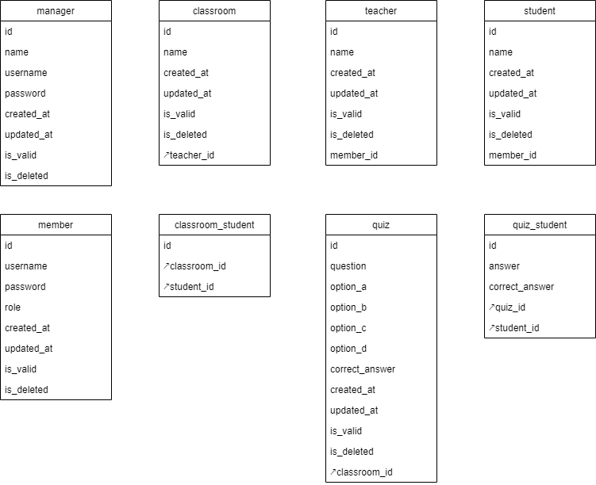

# DotNet6MVCArchitectureSample

這是一個 .net6 mvc framework 的專案架構實例，利用三層式架構（three tiers）以及工廠模式（factory pattern）來展示，其中也展示了 service（BLL）和 repository（DAL）的單元測試實作。

## 使用到的技術

- **.Net Framework** - .Net6 MVC
- **ORM** - EntityFrameworkCore
- **Mapping Tool** - Automapper
- **Log** - Serilog
- **Design Pattern** - Factory Pattern
- **Unit Test** - NUnit、NSubstitute
- **Three Tiers Architecture** - PL（controller + view）、BLL（service）、DAL（repository）

## 主要功能

- 登入系統（後台跟前台獨立）
- 教室系統（老師建立教室，學生可以加入）
- 線上測驗系統（老師建立測驗，學生可以答題）

## 資料表設計

